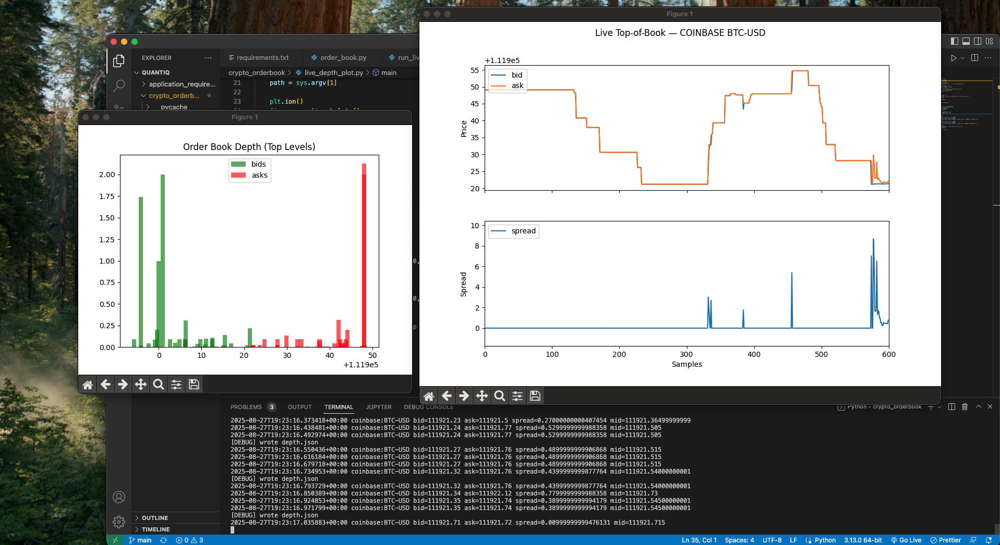

# Crypto Order Book — Live Top-of-Book & Depth Chart



Real-time crypto order book collector and visualizer.

- Streams Coinbase **level2** market data over **WebSocket**
- Maintains full price-level depth in memory
- Logs top-of-book (bid/ask/spread/mid) to CSV
- Exports depth snapshots to `depth.json` (atomic)
- Live plots for **bid/ask** (time series) and **depth** (mirrored book)

> Built to showcase networking, messaging, and financial data processing for trading interviews.

---

## Features

- ✅ Full-depth order book (`price → size`) with best bid/ask tracking
- ✅ WebSocket subscribe + incremental updates (`snapshot` / `l2update`)
- ✅ Top-of-book CSV: `ts_iso,provider,symbol,bid,ask,spread,mid`
- ✅ Atomic `depth.json` writes to avoid partial reads
- ✅ Live **bid/ask plot** + **mirrored depth plot**
- ✅ Robust: handles timeouts, pings, reconnection

---

## Quick Start

### 1. Setup (venv recommended)

```bash
   python3 -m venv venv
   source venv/bin/activate
   pip install --upgrade pip
   pip install -r requirements.txt
```

Minimal requirements.txt:

websocket-client
matplotlib

Python 3.10+ recommended.

### 2. Run the collector (WebSocket → CSV + depth.json)

#### Terminal A

python run_ws_full.py BTC-USD tob_ws_full.csv depth.json

You should see lines like:

[INFO] connecting to wss://ws-feed.exchange.coinbase.com
[INFO] Subscribed request sent for BTC-USD
[DEBUG] snapshot applied
[DEBUG] wrote depth.json
2025-08-27T23:45:12.123456+00:00 coinbase:BTC-USD bid=... ask=... spread=... mid=...

This writes:

tob_ws_full.csv — time series of bid/ask/spread/mid

depth.json — atomic snapshots of top N book levels (default 40)

### 3. Live plots in separate terminals

Bid/Ask time-series (from CSV):

#### Terminal B

python live_plot.py tob_ws_full.csv

Mirrored depth chart (from depth.json):

#### Terminal C

python live_depth_plot.py depth.json

You can open/close plot windows independently while the collector keeps running.

Scripts Overview
order_book_full.py

Maintains two dicts: bids: Dict[float, float], asks: Dict[float, float]

Applies snapshot (replace state) and updates (changes)

Computes best bid/ask, spread, mid, top N levels

Serializes top N to dict for depth dumps

run_ws_full.py

Connects to wss://ws-feed.exchange.coinbase.com

Subscribes to status, level2, and level2_batch for <PRODUCT> (e.g., BTC-USD)

Handles timeouts, pings, reconnection

Writes CSV rows on each update

Atomically writes depth.json (temp file + os.replace)

Usage:

python run_ws_full.py <PRODUCT> <out_csv> [depth_json_path]

#### Example:

python run_ws_full.py BTC-USD tob_ws_full.csv depth.json

live_plot.py

Reads the CSV, plots bid, ask, and spread (separate axis)

Auto-scroll window; good for a running demo

Usage:

python live_plot.py tob_ws_full.csv

live_depth_plot.py

Reads depth.json repeatedly, draws a mirrored depth bar chart:

bids plotted as negative sizes (left), asks as positive (right)

Tolerant to file writes (retries on partial/empty reads)

Usage:

python live_depth_plot.py depth.json

Example CSV (Top-of-Book)
ts_iso,provider,symbol,bid,ask,spread,mid
2025-08-27T23:45:12.805694+00:00,coinbase,BTC-USD,111982.44,111982.45,0.01,111982.445
2025-08-27T23:45:13.149556+00:00,coinbase,BTC-USD,111982.44,111982.45,0.01,111982.445
...

## Troubleshooting

No depth.json appears:
Ensure you’re running run_ws_full.py (not run_ws.py). It prints [DEBUG] wrote depth.json when dumping.
Check you’re in a writable directory.

live_depth_plot.py JSONDecodeError:
You opened it mid-write; the writer is atomic, but if you use an old file, restart the plot script. This repo’s plotter retries automatically.

No messages / timeouts:
The collector handles timeouts with pings and reconnection. If your network blocks Coinbase WS intermittently, try again or switch product (e.g., ETH-USD).

## Roadmap (nice upgrades)

Latency analyzer: capture per-message receive timestamps, compute mean/median/p99 latency & throughput.

Replay benchmark: feed a recorded file back into the order book as fast as possible (msgs/sec).

Toy strategy: simulate a basic market-making rule (PnL & inventory).

Alternative feeds: add Kraken/Binance WS collectors behind a common adapter.

Built by Jose Falconi-Cavallini — real-time data, systems, and trading-adjacent engineering.

GitHub: https://github.com/jfalconi-cavallini

LinkedIn: https://www.linkedin.com/in/jose-falconi-cavallini/
